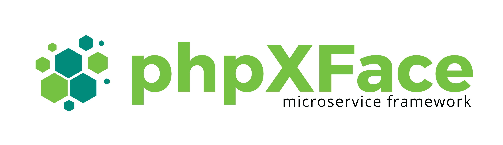

<p align="center">
  
</p>

# phpXFace Front Controller

Small, opinionated Front Controller for phpXFace applications. It wires routing, dispatching (REST and view), CORS preflight handling, and scope‑based authentication into a single entry point you can drop into your `index.php`.

## Project status

This package is a small building block within the phpXFace ecosystem.

- Origin: started as a personal side project in 2013 to explore annotations, DI, modular apps, and an XML‑driven UI.
- Today: published openly for anyone curious about these ideas. Expect legacy code and APIs.
- Maintenance: no longer maintained by the original author. Issues and PRs may not be reviewed or merged. Please consider forking if you need changes.

## Features

- Single entry point to handle every HTTP request
- REST and View dispatchers out of the box
- Route management via `RouteManager` / `RouteAllocation`
- Built‑in CORS preflight (OPTIONS) handling
- Scope‑based auth integration with `phpxface/auth`
- PSR‑0 autoloadable, Composer‑friendly

## Requirements

- PHP 5.4+ (namespaces and short array syntax)
- Composer
- phpXFace core and auth components

## Installation

Install via Composer. If you already depend on phpXFace components, you likely have the required repositories configured. Otherwise, add the VCS repositories (as shown) and require the package:

```json
{
  "require": {
    "phpxface/frontcontroller": "dev-master"
  },
  "repositories": [
    { "type": "vcs", "url": "ssh://git@github.com/phpxface/core.git" },
    { "type": "vcs", "url": "ssh://git@github.com/phpxface/auth.git" }
  ]
}
```

Then run:

```bash
composer update
```

## Quick start

Create your web entry point (e.g., `public/index.php`):

```php
<?php
require __DIR__ . '/../vendor/autoload.php';

use phpXFace\core\lib\FrontController;

$app = new FrontController();
$app->run();
```

Point your web server’s document root to `public/` and route all requests to `index.php`.

## How it works

The `FrontController` bootstraps three core parts of your app:

1) Routing

- A `RouteManager` is created and fed with a `RouteAllocation` instance.
- `RouteManager::setup()` is called to load your routes.
- The controller auto‑detects whether the current request should be dispatched as REST (`isRest() === true`) or as a view.

2) Dispatching

- REST requests are handled by `phpXFace\core\lib\restful\Dispatcher`.
- View requests are handled by `phpXFace\core\lib\dispatch\Dispatcher`.
- Both dispatchers receive the prepared `RouteManager`. For view requests, the shared `Response` is injected so headers/body can be composed and sent.

3) Authentication & CORS

- Preflight: When `REQUEST_METHOD` is `OPTIONS`, supported methods are advertised and the response is sent immediately.
- For REST: `Access-Control-Allow-Origin` is echoed back to the `HTTP_ORIGIN` and controller methods can be decorated with `@PXF_SCOPE` to require a specific auth scope.
- For Views: The current route name is validated against the active scope. If invalid, users are redirected to the configured login endpoint with a base64‑encoded return URL.

## Configuration

The front controller uses phpXFace’s DI/annotations to pick up configuration and services:

- `@PXF_DI("phpXFace\auth\client\models\Scope")` provides an `IScope` implementation.
- `@PXF_Property("auth.myapp.login.endpoint")` sets the login endpoint for unauthenticated view requests.

At minimum, make sure your configuration resolves the property:

- `auth.myapp.login.endpoint` — absolute URL to your login page, e.g. `https://auth.example.com/login`

## REST and CORS details

- Supported methods: `GET, POST, PUT, DELETE`.
- Preflight responses include:
  - `Access-Control-Allow-Origin: <HTTP_ORIGIN>`
  - `Access-Control-Allow-Methods: GET,POST,PUT,DELETE`
  - `Access-Control-Allow-Headers: origin, x-requested-with, content-type, access-control-allow-origin, access-control-allow-methods, access-control-allow-headers, authorization`

## Example: Protecting a REST endpoint by scope

In your REST controller method, add the `@PXF_SCOPE` annotation (provided by phpXFace core annotations) with the scope name you require. When the request is dispatched, the front controller will check the active scope and return `401` if invalid.

```php
use phpXFace\core\lib\annotations\PXF_GET as PXF_GET;
use phpXFace\core\lib\annotations\PXF_SCOPE as PXF_SCOPE;
use myapp\customer\models\CustomerParameter;
use phpXFace\core\lib\collection\HashMap;
use phpXFace\core\lib\delegate\PXFService;
use phpXFace\core\lib\di\Injector;
use phpXFace\core\lib\response\IOutputBuffer;
 
class Customer extends Injector implements PXFService {
 
    /**
     * @PXF_DI("phpXFace\core\lib\response\OutputBuffer")
     * @var IOutputBuffer
     */
    private $outputBuffer;
 
    /**
    * @PXF_GET("api/v1/customers/{id}")
    * @PXF_SCOPE("customers.read")
    * 
    * @param CustomerParameter $params
    */
    public function getCustomerAction(CustomerParameter $params)
    {
        // ...
        $id = $params->getId();
        $result = new HashMap();
        $result->put( 'id', $id );
        $this->outputBuffer->setJsonOutput( $result );
    }
}
```

Contributing
------------
Note: This repository is not actively maintained by the original author. You are encouraged to fork the project and maintain changes independently. If you still prefer to open a PR, please understand it may not be reviewed.

If you submit contributions, please:

1) Open an issue first to discuss substantial changes (responses are not guaranteed).
2) Keep PRs focused and small where possible.
3) Match the existing coding style and structure.
4) Include tests when feasible, or describe manual verification steps.

For security‑related issues, please do not open a public issue. Instead, reach out privately (see Security below).


Security
--------
There is no active security response for this repository. Do not use this project for production workloads without performing your own security review.

If you still wish to report a vulnerability, you may open a minimal issue to request a contact channel, but a response is not guaranteed. Consider maintaining a private fork with your fixes.


Roadmap
-------
There is no official roadmap. Future direction is community‑owned via forks. Possible areas of exploration (if you decide to maintain a fork):

- Document examples for modern PHP versions
- Optional shims/polyfills for compatibility
- CI to exercise a small supported matrix

If you’d like to coordinate with others, you can open an issue, but engagement is not guaranteed.


License
-------
This project is open‑source software. See the `LICENSE` file for details.


Acknowledgements
----------------
This project was inspired by ideas from Android, JavaFX, and various PHP frameworks from the early 2010s. Thanks to everyone who explores, reports issues, and submits improvements.
